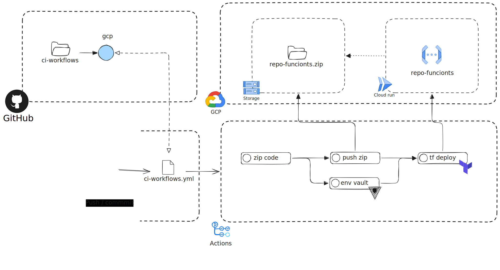

# Proyecto: code-parce-fun

## Qué contiene
- `index.js` — función exportada `getData` que obtiene documentos de Firestore, genera signed URLs desde Cloud Storage y devuelve JSON.
- `index.test.js` — servidor Express local para pruebas (`/data`).
- `.env` — variables de entorno.
- `key.json` — credenciales de servicio GCP.

## Variables de entorno (en `.env`)
- `PROJECT_ID` — ID del proyecto GCP.
- `FIRESTORE_DATABASE_ID` — ID de la instancia Firestore.
- `BUCKET` — nombre del bucket (ver nota).
- `GOOGLE_APPLICATION_CREDENTIALS` — ruta a `key.json`.

## Suposiciones de datos
- Cada documento tiene un array `images` con nombres de archivo.
- Las rutas se forman como `imagenes/<nombre>` y se generan signed URLs con 15 minutos de expiración.

## Cómo probar localmente
1. Instalar dependencias:
    ```bash
    npm install
    ```
2. Ejecutar servidor de pruebas:
    ```bash
    npm run index.test.js
    ```
3. Llamar al endpoint:
    ```bash
    curl -X GET http://localhost:8080/data -H "Content-Type: application/json" -d '{"collection":"NOMBRE_DE_COLECCION"}'
    ```
   

## Errores y comprobaciones
- Añadir `require('dotenv').config()` en `index.js` si vas a ejecutar localmente o exportar variables.
- Verificar que `key.json` existe y `GOOGLE_APPLICATION_CREDENTIALS` apunta correctamente.
- Comprobar permisos de la cuenta de servicio para Firestore y Storage.

## key.json

Comando para sacar el  de la cuenta de servicio, solo se genera este key para probar los test, no es necesario crealas para los deploys

```bash
gcloud iam service-accounts keys create key.json --iam-account=Cuenta-de-servicio@proyecto.iam.gserviceaccount.com
#Activar mediante el key.json
gcloud auth activate-service-account --key-file=key.json
#listar
gcloud auth list
```

## Arquitectura 

